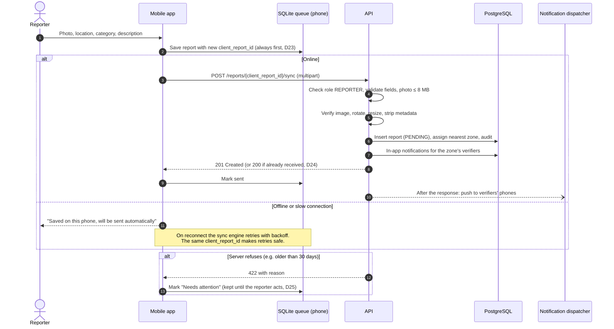

# B.3 Submitting a report (online and offline)

```mermaid
sequenceDiagram
  autonumber
  actor R as Reporter
  participant App as Mobile app
  participant Q as SQLite queue (phone)
  participant API as API
  participant DB as PostgreSQL
  participant N as Notification dispatcher

  R->>App: Photo, location, category, description
  App->>Q: Save report with new client_report_id (always first, D23)
  alt Online
    App->>API: POST /reports/{client_report_id}/sync (multipart)
    API->>API: Check role REPORTER, validate fields, photo ≤ 8 MB
    API->>API: Verify image, rotate, resize, strip metadata
    API->>DB: Insert report (PENDING), assign nearest zone, audit
    API->>DB: In-app notifications for the zone's verifiers
    API-->>App: 201 Created (or 200 if already received, D24)
    App->>Q: Mark sent
    API--)N: After the response: push to verifiers' phones
  else Offline or slow connection
    App-->>R: "Saved on this phone, will be sent automatically"
    Note over App,Q: On reconnect the sync engine retries with backoff.<br/>The same client_report_id makes retries safe.
  end
  alt Server refuses (e.g. older than 30 days)
    API-->>App: 422 with reason
    App->>Q: Mark "Needs attention" (kept until the reporter acts, D25)
  end
```
