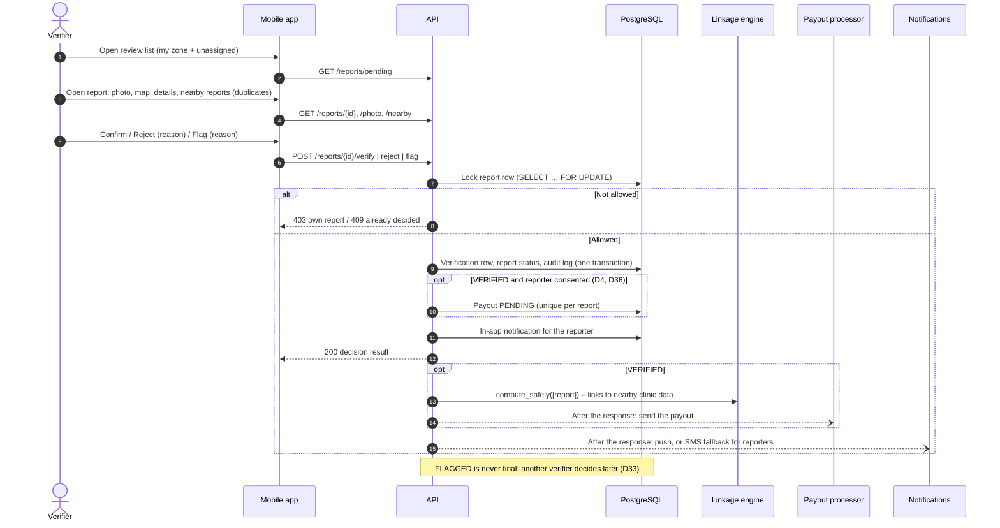

# B.4 Verifying a report

```mermaid
sequenceDiagram
  autonumber
  actor V as Verifier
  participant App as Mobile app
  participant API as API
  participant DB as PostgreSQL
  participant L as Linkage engine
  participant P as Payout processor
  participant N as Notifications

  V->>App: Open review list (my zone + unassigned)
  App->>API: GET /reports/pending
  V->>App: Open report: photo, map, details, nearby reports (duplicates)
  App->>API: GET /reports/{id}, /photo, /nearby
  V->>App: Confirm / Reject (reason) / Flag (reason)
  App->>API: POST /reports/{id}/verify | reject | flag
  API->>DB: Lock report row (SELECT … FOR UPDATE)
  alt Not allowed
    API-->>App: 403 own report / 409 already decided
  else Allowed
    API->>DB: Verification row, report status, audit log (one transaction)
    opt VERIFIED and reporter consented (D4, D36)
      API->>DB: Payout PENDING (unique per report)
    end
    API->>DB: In-app notification for the reporter
    API-->>App: 200 decision result
    opt VERIFIED
      API->>L: compute_safely([report]) – links to nearby clinic data
      API--)P: After the response: send the payout
    end
    API--)N: After the response: push, or SMS fallback for reporters
  end
  Note over API,DB: FLAGGED is never final: another verifier decides later (D33)
```
