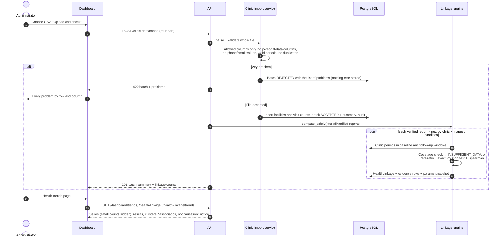

# B.5 Clinic data import and health linkage

```mermaid
sequenceDiagram
  autonumber
  actor A as Administrator
  participant D as Dashboard
  participant API as API
  participant I as Clinic import service
  participant DB as PostgreSQL
  participant L as Linkage engine

  A->>D: Choose CSV, "Upload and check"
  D->>API: POST /clinic-data/import (multipart)
  API->>I: parse + validate whole file
  I->>I: Allowed columns only, no personal-data columns,<br/>no phone/email values, valid periods, no duplicates
  alt Any problem
    I->>DB: Batch REJECTED with the list of problems (nothing else stored)
    API-->>D: 422 batch + problems
    D-->>A: Every problem by row and column
  else File accepted
    I->>DB: Upsert facilities and visit counts, batch ACCEPTED + summary, audit
    API->>L: compute_safely() for all verified reports
    loop each verified report × nearby clinic × mapped condition
      L->>DB: Clinic periods in baseline and follow-up windows
      L->>L: Coverage check → INSUFFICIENT_DATA, or<br/>rate ratio + exact Poisson test + Spearman
      L->>DB: HealthLinkage + evidence rows + params snapshot
    end
    API-->>D: 201 batch summary + linkage counts
  end
  A->>D: Health trends page
  D->>API: GET /dashboard/trends, /health-linkage, /health-linkage/trends
  API-->>D: Series (small counts hidden), results, clusters, "association, not causation" notice
```
