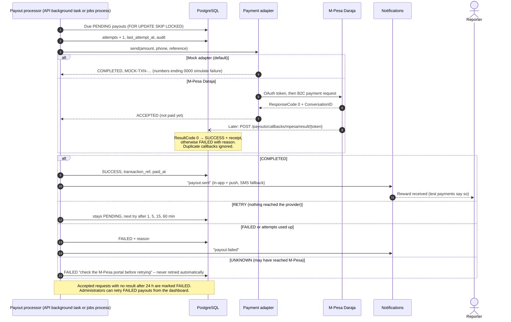

# B.6 Incentive payout

```mermaid
sequenceDiagram
  autonumber
  participant P as Payout processor (API background task or jobs process)
  participant DB as PostgreSQL
  participant AD as Payment adapter
  participant MP as M-Pesa Daraja
  participant N as Notifications
  actor R as Reporter

  P->>DB: Due PENDING payouts (FOR UPDATE SKIP LOCKED)
  P->>DB: attempts + 1, last_attempt_at, audit
  P->>AD: send(amount, phone, reference)
  alt Mock adapter (default)
    AD-->>P: COMPLETED, MOCK-TXN-… (numbers ending 0000 simulate failure)
  else M-Pesa Daraja
    AD->>MP: OAuth token, then B2C payment request
    MP-->>AD: ResponseCode 0 + ConversationID
    AD-->>P: ACCEPTED (not paid yet)
    MP--)DB: Later: POST /payouts/callbacks/mpesa/result/{token}
    Note over DB: ResultCode 0 → SUCCESS + receipt,<br/>otherwise FAILED with reason.<br/>Duplicate callbacks ignored.
  end
  alt COMPLETED
    P->>DB: SUCCESS, transaction_ref, paid_at
    P->>N: "payout.sent" (in-app + push, SMS fallback)
    N-->>R: Reward received (test payments say so)
  else RETRY (nothing reached the provider)
    P->>DB: stays PENDING, next try after 1, 5, 15, 60 min
  else FAILED or attempts used up
    P->>DB: FAILED + reason
    P->>N: "payout.failed"
  else UNKNOWN (may have reached M-Pesa)
    P->>DB: FAILED "check the M-Pesa portal before retrying" – never retried automatically
  end
  Note over P,DB: Accepted requests with no result after 24 h are marked FAILED.<br/>Administrators can retry FAILED payouts from the dashboard.
```
