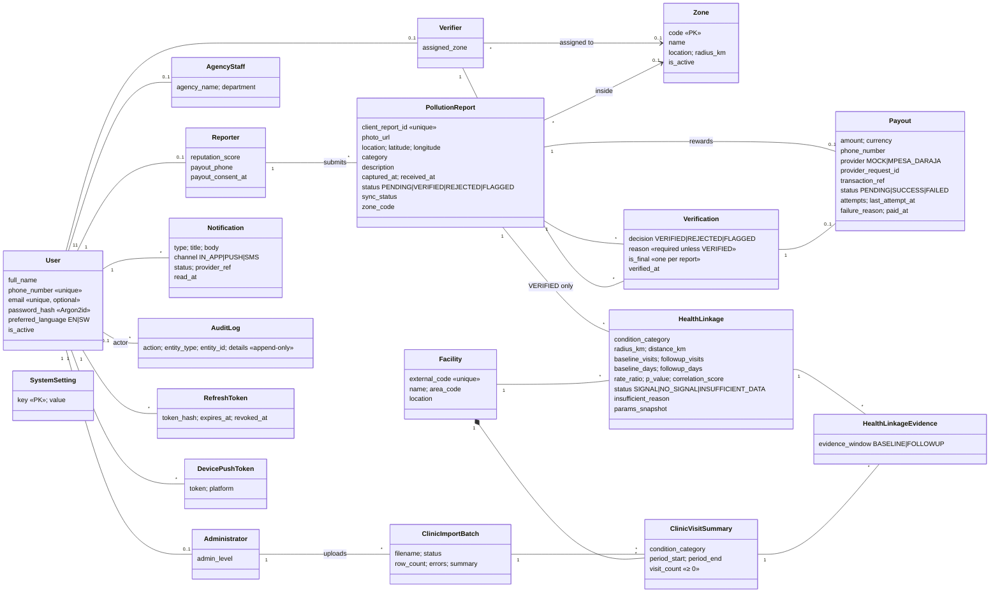

# Class diagram (as built)

Every id is a UUID. `location` columns are PostGIS geography points computed by
the database from latitude and longitude.

```mermaid
classDiagram
  direction LR
  class User {
    full_name
    phone_number «unique»
    email «unique, optional»
    password_hash «Argon2id»
    preferred_language EN|SW
    is_active
  }
  class Reporter {
    reputation_score
    payout_phone
    payout_consent_at
  }
  class Verifier { assigned_zone }
  class AgencyStaff { agency_name; department }
  class Administrator { admin_level }
  class Zone {
    code «PK»
    name
    location; radius_km
    is_active
  }
  class PollutionReport {
    client_report_id «unique»
    photo_url
    location; latitude; longitude
    category
    description
    captured_at; received_at
    status PENDING|VERIFIED|REJECTED|FLAGGED
    sync_status
    zone_code
  }
  class Verification {
    decision VERIFIED|REJECTED|FLAGGED
    reason «required unless VERIFIED»
    is_final «one per report»
    verified_at
  }
  class Payout {
    amount; currency
    phone_number
    provider MOCK|MPESA_DARAJA
    provider_request_id
    transaction_ref
    status PENDING|SUCCESS|FAILED
    attempts; last_attempt_at
    failure_reason; paid_at
  }
  class Facility {
    external_code «unique»
    name; area_code
    location
  }
  class ClinicImportBatch {
    filename; status
    row_count; errors; summary
  }
  class ClinicVisitSummary {
    condition_category
    period_start; period_end
    visit_count «≥ 0»
  }
  class HealthLinkage {
    condition_category
    radius_km; distance_km
    baseline_visits; followup_visits
    baseline_days; followup_days
    rate_ratio; p_value; correlation_score
    status SIGNAL|NO_SIGNAL|INSUFFICIENT_DATA
    insufficient_reason
    params_snapshot
  }
  class HealthLinkageEvidence { evidence_window BASELINE|FOLLOWUP }
  class Notification {
    type; title; body
    channel IN_APP|PUSH|SMS
    status; provider_ref
    read_at
  }
  class AuditLog { action; entity_type; entity_id; details «append-only» }
  class RefreshToken { token_hash; expires_at; revoked_at }
  class DevicePushToken { token; platform }
  class SystemSetting { key «PK»; value }

  User "1" -- "0..1" Reporter
  User "1" -- "0..1" Verifier
  User "1" -- "0..1" AgencyStaff
  User "1" -- "0..1" Administrator
  Verifier "*" --> "0..1" Zone : assigned to
  Reporter "1" -- "*" PollutionReport : submits
  PollutionReport "*" --> "0..1" Zone : inside
  PollutionReport "1" -- "*" Verification
  Verifier "1" -- "*" Verification : decides
  PollutionReport "1" -- "0..1" Payout : rewards
  Verification "1" -- "0..1" Payout
  Administrator "1" -- "*" ClinicImportBatch : uploads
  ClinicImportBatch "1" -- "*" ClinicVisitSummary
  Facility "1" *-- "*" ClinicVisitSummary
  PollutionReport "1" -- "*" HealthLinkage : VERIFIED only
  Facility "1" -- "*" HealthLinkage
  HealthLinkage "1" -- "*" HealthLinkageEvidence
  ClinicVisitSummary "1" -- "*" HealthLinkageEvidence
  User "1" -- "*" Notification
  User "1" -- "*" RefreshToken
  User "1" -- "*" DevicePushToken
  User "0..1" -- "*" AuditLog : actor
```
